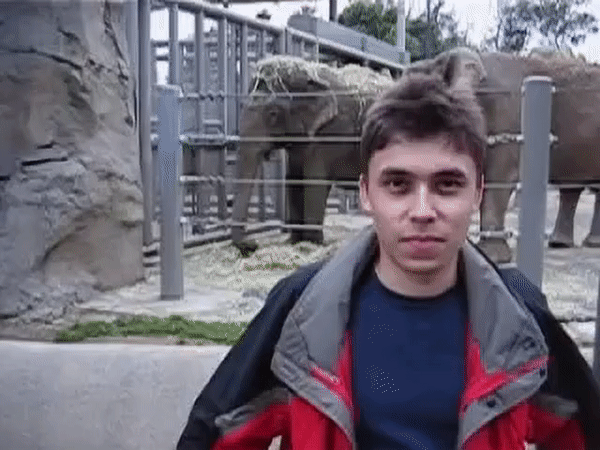

[![Contributors][contributors-shield]][contributors-url]
[![Forks][forks-shield]][forks-url]
[![Stargazers][stars-shield]][stars-url]
[![Issues][issues-shield]][issues-url]
[![MIT License][license-shield]][license-url]


<!-- PROJECT LOGO -->
<br />
<p align="center">
  <a href="https://github.com/viraatdas/video-super-resolution">
  </a>
  <h3 align="center">Video Super Resolution</h3>
  <p align="center">
    Image Super Resolution (ISR) is a way to improve quality of low resolution images and upscale it. This project utilizes that and enables it to be used for videos. 
    <br />
    <a href="https://github.com/viraatdas/video-super-resolution"><strong>Explore the docs »</strong></a>
    <br />
    <br />
    <a href="https://github.com/viraatdas/video-super-resolution#demo">View Demo</a>
    ·
    <a href="https://github.com/viraatdas/video-super-resolution/issues">Report Bug</a>
    ·
    <a href="https://github.com/viraatdas/video-super-resolution/issues">Request Feature</a>
  </p>
</p>


<!-- TABLE OF CONTENTS -->
<details open="open">
  <summary><h2 style="display: inline-block">Table of Contents</h2></summary>
  <ol>
    <li>
      <a href="#about-the-project">About The Project</a>
      <ul>
        <li><a href="#built-with">Built With</a></li>
      </ul>
    </li>
    <li>
      <a href="#getting-started">Getting Started</a>
      <ul>
        <li><a href="#prerequisites">Prerequisites</a></li>
        <li><a href="#installation">Installation</a></li>
      </ul>
    </li>
    <li><a href="#usage">Usage</a></li>
    <li><a href="#roadmap">Roadmap</a></li>
    <li><a href="#contributing">Contributing</a></li>
    <li><a href="#license">License</a></li>
    <li><a href="#contact">Contact</a></li>
  
  </ol>
</details>


<!-- ABOUT THE PROJECT -->
## About The Project

The project was developed using Python 3.6. The aim of this is to scale up a video and increase the quality of it. Using Image Super Resolution, each frame is scaled up. The various deep learning methods allow for quality to improve even though the video is scaled up. You can learn more about ISR [here](https://github.com/idealo/image-super-resolution).

Currently this has only been tested on `mp4` videos.

## Demo
Original                   |  Video Super Resolution
:-------------------------:|:-------------------------:
  |  

### Built With

* [ISR](https://github.com/idealo/image-super-resolution)
* [OpenCV](https://github.com/opencv/opencv)
* [ffmpeg](https://ffmpeg.org/ffmpeg.html)


<!-- GETTING STARTED -->
## Getting Started

Follow the steps to get started 


### Prerequisites

* ffmpeg 
  - Mac: 
    - ```sh
      brew install ffmpeg
      ```
  - Linux: 
    - ```sh
        sudo apt install ffmpeg
        ```
Python 3.6 might be required. Take a look at [pyenv](https://github.com/pyenv/pyenv) for managing multiply Python versions. 

### Installation

1. Clone the repo
   ```sh
   git clone https://github.com/viraatdas/video-super-resolution.git
   ```
2. Install modules
   ```sh
   pip install -r requirements.txt
   ```


<!-- USAGE EXAMPLES -->
## Usage
Example: `python enhance.py example_videos/video_short.mp4`

Example: `python enhance.py example_videos/video_short.mp4 --zoom 3 --remove_noise` 

```
positional arguments:
  filename              Required positional argument

optional arguments:
  -h, --help            show this help message and exit
  --zoom ZOOM           Specifies scaling factor of video (default is 2x)
  --remove_noise        If specified, then will denoise the video
  --output_filename     OUTPUT_FILENAME
                        Specify output filename
  --version             show program's version number and exit
```


<!-- ROADMAP -->
## Roadmap

See the [open issues](https://github.com/viraatdas/video-super-resolution/issues) for a list of proposed features (and known issues). Feel free to add to it. 


<!-- CONTRIBUTING -->
## Contributing

Contributions are what make the open source community such an amazing place to be learn, inspire, and create. Any contributions you make are **greatly appreciated**.

1. Fork the Project
2. Create your Feature Branch (`git checkout -b feature/AmazingFeature`)
3. Commit your Changes (`git commit -m 'Add some AmazingFeature'`)
4. Push to the Branch (`git push origin feature/AmazingFeature`)
5. Open a Pull Request


<!-- LICENSE -->
## License

Distributed under the MIT License. See `LICENSE` for more information.


<!-- CONTACT -->
## Contact

Viraat Das - [@therealviraat](https://twitter.com/therealviraat) - viraat.laldas@gmail.com

README template based on [othneildrew](https://github.com/othneildrew/Best-README-Template)


<!-- MARKDOWN LINKS & IMAGES -->
<!-- https://www.markdownguide.org/basic-syntax/#reference-style-links -->
[contributors-shield]: https://img.shields.io/github/contributors/viraatdas/video-super-resolution.svg?style=for-the-badge
[contributors-url]: https://github.com/viraatdas/video-super-resolution/graphs/contributors
[forks-shield]: https://img.shields.io/github/forks/viraatdas/video-super-resolution.svg?style=for-the-badge
[forks-url]: https://github.com/viraatdas/video-super-resolution/network/members
[stars-shield]: https://img.shields.io/github/stars/viraatdas/video-super-resolution.svg?style=for-the-badge
[stars-url]: https://github.com/viraatdas/video-super-resolution/stargazers
[issues-shield]: https://img.shields.io/github/issues/viraatdas/video-super-resolution.svg?style=for-the-badge
[issues-url]: https://github.com/viraatdas/video-super-resolution/issues
[license-shield]: https://img.shields.io/github/license/viraatdas/video-super-resolution.svg?style=for-the-badge
[license-url]: https://github.com/viraatdas/video-super-resolution/blob/master/LICENSE.txt
[linkedin-shield]: https://img.shields.io/badge/-LinkedIn-black.svg?style=for-the-badge&logo=linkedin&colorB=555
[linkedin-url]: https://linkedin.com/in/viraatdas

